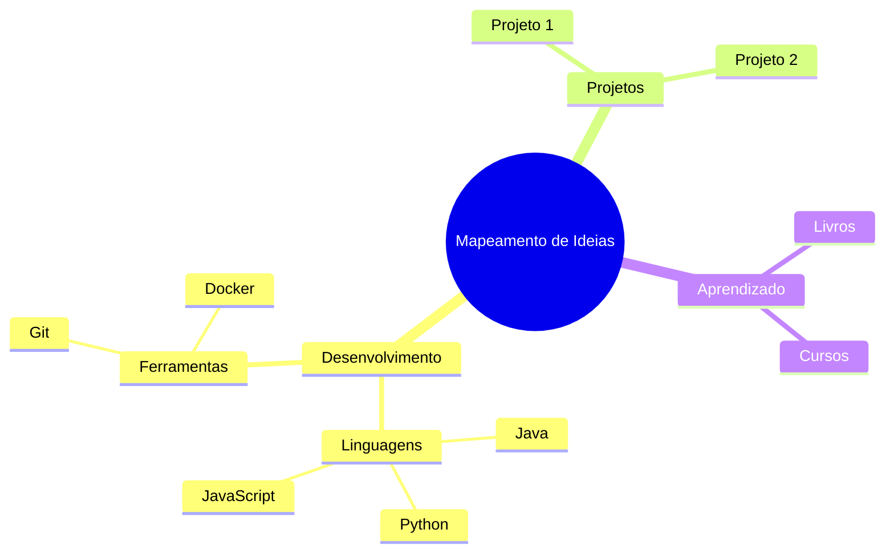
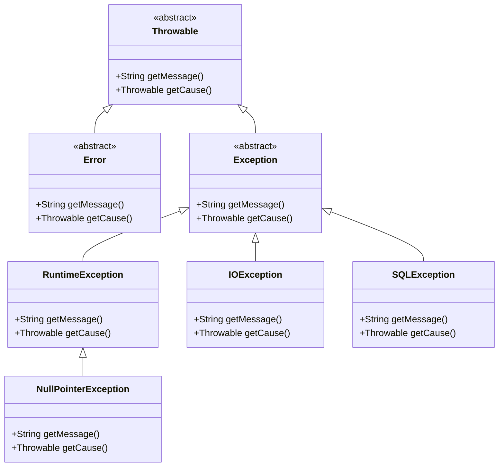

# Sumário
---
1. [Introdução](#introdução)
2. [Variáveis](#variáveis)
3. [Projeto Tabuada](#projeto-tabuada)
4. [Projeto Média Aluno](#projeto-média-aluno)
5. [Condicionais](#condicionais)
6. [Projeto Calculadora](#projeto-calculadora)
7. [Projeto Classificação Produto](#projeto-classificação-produto)
8. [Funções](#funções)
9. [Projeto Conversor de Temperatura](#projeto-conversor-de-temperatura)
10. [Projeto Contador de Palavras](#projeto-contador-de-palavras)
11. [Estruturas de Repetição](#estruturas-de-repetição)
12. [Calculadora Simples](#calculadora-simples)
13. [Jogo da Adivinhação](#jogo-da-adivinhação)
14. [Arrays](#arrays)
15. [Jogo da Forca](#jogo-da-forca)
16. [Verificador de Senha](#verificador-de-senha)
17. [POO](#poo)
18. [Loteria](#loteria)
19. [Sistema Cadastro Alunos](#sistema-cadastro-alunos)
20. [Avançando em POO](#avançando-em-poo)
21. [Tratamento de Erros e Exceções](#tratamento-de-erros-e-exceções)
22. [Manipulação de Arquivos e Diretórios](#manipulação-de-arquivos-e-diretórios)
23. [Trabalhando com Threads](#trabalhando-com-threads)
24. [Banco de Dados com JDBC](#banco-de-dados-com-jdbc)
25. [Projeto Sistema de Vendas](#projeto-sistema-de-vendas)
26. [Projeto Final](#projeto-final)

---

**Plano de curso**

| **Tópicos Principais**        | **Subtópicos**                      | **Detalhes**                                                   |
|-------------------------------|--------------------------------------|----------------------------------------------------------------|
| **1. Introdução à POO**       | 1.1 O que é POO                     | Definição, princípios e histórico da POO                      |
|                               | 1.2 Java como Linguagem Orientada a Objetos | Características e vantagens do Java para POO                 |
|                               | 1.3 Configuração do Ambiente        | Instalação do JDK, IDEs (Eclipse, IntelliJ, VS Code)          |
| **2. Fundamentos de POO**     | 2.1 Classes e Objetos               | Estrutura de uma classe, criação e manipulação de objetos      |
|                               | 2.2 Atributos e Métodos             | Declaração, uso e acesso aos membros de uma classe            |
|                               | 2.3 Encapsulamento                  | Modificadores de acesso, getters e setters                    |
|                               | 2.4 Construtores                   | Criação de construtores e sobrecarga                          |
| **3. Princípios de POO**      | 3.1 Herança                        | Conceito, reutilização de código, superclasses e subclasses    |
|                               | 3.2 Polimorfismo                   | Sobrescrita de métodos, uso de interfaces e classes abstratas  |
|                               | 3.3 Abstração                      | Classes abstratas e interfaces                                |
|                               | 3.4 Associação, Composição e Agregação | Relações entre classes                                         |
| **4. Trabalhando com Coleções** | 4.1 Arrays vs Coleções             | Diferenças e quando usar cada um                               |
|                               | 4.2 Introdução às Coleções Java     | List, Set, Map, e suas implementações (ArrayList, HashMap)     |
|                               | 4.3 Iteração e Manipulação de Dados | Uso de loops e streams para trabalhar com coleções            |
| **5. Manipulação de Exceções** | 5.1 Introdução às Exceções         | O que são, como ocorrem e tipos de exceções                   |
|                               | 5.2 Tratamento de Exceções          | Blocos try-catch, finally e throw                             |
|                               | 5.3 Exceções Personalizadas         | Criação e uso de exceções específicas para o projeto          |
| **6. Práticas Avançadas de POO** | 6.1 Classes Internas e Anônimas   | Uso e aplicação                                                |
|                               | 6.2 Generics                       | Tipagem genérica para coleções e métodos                      |
|                               | 6.3 Lambdas e Streams              | Introdução à programação funcional em Java                    |
| **7. Interfaces Gráficas**    | 7.1 Introdução ao Swing e AWT       | Componentes básicos, criação de janelas                       |
|                               | 7.2 Eventos                        | Manipulação de eventos em interfaces gráficas                 |
|                               | 7.3 Projetos Práticos              | Criação de pequenas aplicações com interfaces                 |
| **8. Persistência de Dados**  | 8.1 Introdução ao JDBC             | Conexão com bancos de dados                                   |
|                               | 8.2 Operações CRUD                 | Inserção, consulta, atualização e exclusão de dados           |
|                               | 8.3 Padrão DAO                     | Organização do acesso aos dados                               |
| **9. Projeto Final**          | 9.1 Definição de Problema           | Escolha do tema e requisitos                                  |
|                               | 9.2 Desenvolvimento                | Implementação usando os conceitos aprendidos                  |
|                               | 9.3 Apresentação                   | Demonstração da aplicação e relatório final   

---

1. [Introdução](#introdução)  
   - [Introdução ao curso](#introdução-ao-curso)  
   - [Apresentação do curso](#apresentação-do-curso)  
   - [Por Que Aprender Java?](#por-que-aprender-java)  
   - [Instalando o Java](#instalando-o-java)  
   - [Instalando o Visual Studio Code](#instalando-o-visual-studio-code)  
   - [Primeiro Programa](#primeiro-programa)  
   - [Considerações Gerais](#considerações-gerais)  
   - [Executando arquivo pelo terminal](#executando-arquivo-pelo-terminal)  
   - [Arquivos do curso](#arquivos-do-curso)  
   - [Indicação de Livro](#indicação-de-livro)  
   - [Conclusão](#conclusão-introdução)  
2. [Variáveis](#variáveis)  
   - [O Que São Variáveis?](#o-que-são-variáveis)  
   - [Algumas Regras de Variáveis](#algumas-regras-de-variáveis)  
   - [Tipos de Dados Primitivos](#tipos-de-dados-primitivos)  
   - [Atribuição de Valor com Outra Variável](#atribuição-de-valor-com-outra-variável)  
   - [Comentários em Java](#comentários-em-java)  
   - [Strings](#strings)  
   - [Char](#char)  
   - [Int](#int)  
   - [Long](#long)  
   - [Double](#double)  
   - [Operadores Aritméticos: Parte 1](#operadores-aritméticos-parte-1)  
   - [Operadores Aritméticos: Parte 2](#operadores-aritméticos-parte-2)  
   - [Type Casting](#type-casting)  
   - [Exercícios](#exercícios-variáveis)  
   - [Constantes](#constantes)  
   - [Inferência de Tipo com var](#inferência-de-tipo-com-var)  
   - [A Classe Scanner](#a-classe-scanner)  
   - [Importação de Pacotes](#importação-de-pacotes)  
   - [Fechamento do Scanner](#fechamento-do-scanner)  
   - [Problema com nextLine](#problema-com-nextline)  
   - [Conclusão](#conclusão-variáveis)  
3. [Projeto Tabuada](#projeto-tabuada)  
   - [Introdução](#introdução-projeto-tabuada)  
   - [Criando a Tabuada](#criando-a-tabuada)  
4. [Projeto Média Aluno](#projeto-média-aluno)  
   - [Introdução](#introdução-projeto-média-aluno)  
   - [Calculando a Média](#calculando-a-média)  
5. [Condicionais](#condicionais)  
   - [O Que é Boolean](#o-que-é-boolean)  
   - [Operadores de Comparação](#operadores-de-comparação)  
   - [Atribuição e Comparação](#atribuição-e-comparação)  
   - [Comparação de Strings](#comparação-de-strings)  
   - [Estruturas de Condição](#estruturas-de-condição)  
   - [Conhecendo o If](#conhecendo-o-if)  
   - [Explorando o Else](#explorando-o-else)  
   - [Utilizando o Else If](#utilizando-o-else-if)  
   - [Operadores Lógicos](#operadores-lógicos)  
   - [Tabela Verdade](#tabela-verdade)  
   - [Trabalhando com o AND](#trabalhando-com-o-and)  
   - [Operador Lógico OR](#operador-lógico-or)  
   - [Como Funciona o NOT](#como-funciona-o-not)  
   - [Conhecendo o Switch](#conhecendo-o-switch)  
   - [Implementando o Default](#implementando-o-default)  
   - [Switch sem Break](#switch-sem-break)  
   - [Quando usar IF e quando usar Switch](#quando-usar-if-e-quando-usar-switch)  
   - [Exercícios 1 e 2](#exercícios-1-e-2)  
   - [Exercícios 3 e 4](#exercícios-3-e-4)  
   - [Exercícios 5 e 6](#exercícios-5-e-6)  
   - [Condicional Ternária](#condicional-ternária)  
   - [If Else Aninhado](#if-else-aninhado)  
   - [Precedência de Operadores Lógicos](#precedência-de-operadores-lógicos)  
   - [Conclusão](#conclusão-condicionais)
6. [Projeto Calculadora](#projeto-calculadora)  
   - [Introdução](#introdução-projeto-calculadora)  
   - [Criando a Calculadora](#criando-a-calculadora)  
7. [Projeto Classificação Produto](#projeto-classificação-produto)  
   - [Introdução](#introdução-projeto-classificação-produto)  
   - [Construção do Projeto](#construção-do-projeto)  
8. [Funções](#funções)  
   - [O que é uma Função](#o-que-é-uma-função)  
   - [Criando a Primeira Função](#criando-a-primeira-função)  
   - [Diferença entre a Função Main e outras Funções](#diferença-entre-a-função-main-e-outras-funções)  
   - [Argumentos em Funções](#argumentos-em-funções)  
   - [Retorno de Função](#retorno-de-função)  
   - [Funções com Retorno X Sem Retorno](#funções-com-retorno-x-sem-retorno)  
   - [Encapsulando Valor de Retorno em Variáveis](#encapsulando-valor-de-retorno-em-variáveis)  
   - [Funções com Condicionais Complexas](#funções-com-condicionais-complexas)  
   - [Funções com Switch](#funções-com-switch)  
   - [Exit em Funções](#exit-em-funções)  
   - [Documentação de Funções](#documentação-de-funções)  
   - [Escopo em Java](#escopo-em-java)  
   - [O que são Funções Built-in](#o-que-são-funções-built-in)  
   - [Funções de String](#funções-de-string)  
   - [Funções de Math](#funções-de-math)  
   - [Exercícios Parte 1](#exercícios-parte-1)  
   - [Exercícios Parte 2](#exercícios-parte-2)  
   - [Exercícios Parte 3](#exercícios-parte-3)  
   - [Função Recursiva](#função-recursiva)  
   - [Method Overloading](#method-overloading)  
   - [Funções Anônimas](#funções-anônimas)  
   - [Conclusão](#conclusão-funções)  
9. [Projeto Conversor de Temperatura](#projeto-conversor-de-temperatura)  
   - [Apresentação](#apresentação-projeto-conversor-de-temperatura)  
   - [Obtendo Opção do Usuário](#obtendo-opção-do-usuário)  
   - [Funções de Conversão](#funções-de-conversão)  
10. [Projeto Contador de Palavras](#projeto-contador-de-palavras)  
    - [Apresentação](#apresentação-projeto-contador-de-palavras)  
    - [Contando as Palavras de uma Frase](#contando-as-palavras-de-uma-frase)  
    - [Funcionalidade de Continuar o Programa](#funcionalidade-de-continuar-o-programa)  
11. [Estruturas de Repetição](#estruturas-de-repetição)  
    - [O que são Estruturas de Repetição](#o-que-são-estruturas-de-repetição)  
    - [Conhecendo o For](#conhecendo-o-for)  
    - [Utilizando o While](#utilizando-o-while)  
    - [Loop Infinito](#loop-infinito)  
    - [Do While](#do-while)  
    - [Break em Loops](#break-em-loops)  
    - [Continue em Loops](#continue-em-loops)  
    - [Nested Loops](#nested-loops)  
    - [Exercícios Parte 1](#exercícios-parte-1-estruturas)  
    - [Exercícios Parte 2](#exercícios-parte-2-estruturas)  
    - [Exercícios Parte 3](#exercícios-parte-3-estruturas)  
    - [Labels em Loops](#labels-em-loops)  
    - [Erro Off By One](#erro-off-by-one)  
    - [Conclusão](#conclusão-estruturas)  
12. [Calculadora Simples](#calculadora-simples)  
    - [Introdução](#introdução-calculadora-simples)  
    - [Recebendo Dados do Usuário](#recebendo-dados-do-usuário)  
    - [Criando Operações da Calculadora](#criando-operações-da-calculadora)  
    - [Exibindo o Resultado](#exibindo-o-resultado)  
13. [Jogo da Adivinhação](#jogo-da-adivinhação)  
    - [Apresentação](#apresentação-jogo-da-adivinhação)  
    - [Gerando Número Aleatório](#gerando-número-aleatório)  
    - [Recebendo Palpite e Exibindo Resultado](#recebendo-palpite-e-exibindo-resultado)  
14. [Arrays](#arrays)  
    - [O que são Arrays](#o-que-são-arrays)  
    - [Sintaxe dos Arrays](#sintaxe-dos-arrays)  
    - [Loops em Arrays](#loops-em-arrays)  
    - [Utilizando o Foreach](#utilizando-o-foreach)  
    - [For x Foreach](#for-x-foreach)  
    - [Loop com Condicionais](#loop-com-condicionais)  
    - [Atualização de Valores em Arrays](#atualização-de-valores-em-arrays)  
    - [Conhecendo o Método toString](#conhecendo-o-método-tostring)  
    - [Adicionando Novos Itens a Arrays](#adicionando-novos-itens-a-arrays)  
    - [Problema de Reference Trap](#problema-de-reference-trap)  
    - [Matrizes](#matrizes)  
    - [Exercícios Parte 1](#exercícios-parte-1-arrays)  
    - [Exercícios Parte 2](#exercícios-parte-2-arrays)  
    - [Exercícios Parte 3](#exercícios-parte-3-arrays)  
    - [Ordenação de Arrays](#ordenação-de-arrays)  
    - [Manipulação Avançada de Arrays](#manipulação-avançada-de-arrays)  
    - [Arrays Dinâmicos](#arrays-dinâmicos)  
    - [Conclusão](#conclusão-arrays)  
15. [Jogo da Forca](#jogo-da-forca)  
    - [Apresentação](#apresentação-jogo-da-forca)  
    - [Criando Array da Palavra Secreta](#criando-array-da-palavra-secreta)  
    - [Recebendo Letras do Usuário](#recebendo-letras-do-usuário)  
    - [Condição de Vitória](#condição-de-vitória)  
16. [Verificador de Senha](#verificador-de-senha)  
    - [Apresentação](#apresentação-verificador-de-senha)  
    - [Recebendo Senha do Usuário](#recebendo-senha-do-usuário)  
    - [Imprimindo a Força da Senha](#imprimindo-a-força-da-senha)  
17. [POO](#poo)  
    - [O que é Orientação a Objetos](#o-que-é-orientação-a-objetos)  
    - [Terminologia de Orientação a Objetos](#terminologia-de-orientação-a-objetos)  
    - [Criando uma Classe](#criando-uma-classe)  
    - [Instanciando Objetos](#instanciando-objetos)  
    - [Criando Métodos](#criando-métodos)  
    - [O que é Encapsulation](#o-que-é-encapsulation)  
    - [Criando Propriedades](#criando-propriedades)  
    - [Mais sobre o This](#mais-sobre-o-this)  
    - [Explorando os Setters](#explorando-os-setters)  
    - [Criando Getters](#criando-getters)  
    - [Getters e Setters com Lógica](#getters-e-setters-com-lógica)  
    - [Método Dentro de Método](#método-dentro-de-método)  
    - [O que são Construtores](#o-que-são-construtores)  
    - [Exercícios Parte 1 a 5](#exercícios-parte-1-a-5-poo)  
    - [Modificadores de Acesso](#modificadores-de-acesso)  
    - [Classes Imutáveis](#classes-imutáveis)  
    - [Arrays em Classes](#arrays-em-classes)  
    - [Conclusão](#conclusão-poo)  
18. [Loteria](#loteria)  
    - [Apresentação](#apresentação-loteria)  
    - [Criando Classe Bilhete](#criando-classe-bilhete)  
    - [Criando Método para Realizar Sorteio](#criando-método-para-realizar-sorteio)  
    - [Exibindo Resultados](#exibindo-resultados)  
19. [Sistema Cadastro Alunos](#sistema-cadastro-alunos)  
    - [Apresentação](#apresentação-sistema-cadastro-alunos)  
    - [Cadastrando Aluno](#cadastrando-aluno)  
    - [Criando Métodos do Aluno](#criando-métodos-do-aluno)  
    - [Exibindo Resultados dos Alunos](#exibindo-resultados-dos-alunos)  
20. [Avançando em POO](#avançando-em-poo)  
    - [Object Composition](#object-composition)  
    - [Herança](#herança)  
    - [A Classe Object](#a-classe-object)  
    - [Sobrescrita de Métodos](#sobrescrita-de-métodos)  
    - [Mais Detalhes sobre o Super](#mais-detalhes-sobre-o-super)  
    - [Abstraction](#abstraction)  
    - [Classes Abstratas](#classes-abstratas)  
    - [Interfaces](#interfaces)  
    - [Múltiplas Interfaces](#múltiplas-interfaces)  
    - [Métodos com Default](#métodos-com-default)  
    - [Classe Abstrata X Interface](#classe-abstrata-x-interface)  
    - [Polimorfismo](#polimorfismo)  
    - [Exercícios Parte 1 a 5](#exercícios-parte-1-a-5-avançando)  
    - [Classes e Métodos com Final](#classes-e-métodos-com-final)  
    - [Introdução a Reflection API](#introdução-a-reflection-api)  
    - [Conclusão](#conclusão-avançando)  
21. [Tratamento de Erros e Exceções](#tratamento-de-erros-e-exceções)  
    - [O que é uma Exceção](#o-que-é-uma-exceção)  
    - [Tempo de Compilação e Tempo de Execução](#tempo-de-compilação-e-tempo-de-execução)  
    - [Bloco Try Catch](#bloco-try-catch)  
    - [Bloco Finally](#bloco-finally)  
    - [Exceções Verificadas X Não Verificadas](#exceções-verificadas-x-não-verificadas)  
    - [Exceções com Throw](#exceções-com-throw)  
    - [Exceções Customizadas](#exceções-customizadas)  
    - [Throws em Métodos](#throws-em-métodos)  
    - [Encadeamento de Exceções](#encadeamento-de-exceções)  
    - [Boas Práticas com Exceções](#boas-práticas-com-exceções)  
    - [Exceções Multicatch](#exceções-multicatch)  
    - [Re-Lançando uma Exceção](#re-lançando-uma-exceção)  
    - [Conclusão](#conclusão-tratamento-de-erros-e-exceções)  
22. [Manipulação de Arquivos e Diretórios](#manipulação-de-arquivos-e-diretórios)  
    - [O que é Manipulação de Arquivo](#o-que-é-manipulação-de-arquivo)  
    - [Preparação para Trabalhar com Arquivos e Diretórios](#preparação-para-trabalhar-com-arquivos-e-diretórios)  
    - [Leitura de Arquivos](#leitura-de-arquivos)  
    - [Escrevendo em Arquivos](#escrevendo-em-arquivos)  
    - [Serializando Objetos](#serializando-objetos)  
    - [Deserializando Objetos](#deserializando-objetos)  
    - [Manipulação de Arquivos Binários](#manipulação-de-arquivos-binários)  
    - [Cópia de Vídeo com Buffer](#cópia-de-vídeo-com-buffer)  
    - [Manipulando Imagens no Java](#manipulando-imagens-no-java)  
    - [Criando Diretórios com Java](#criando-diretórios-com-java)  
    - [Copiando e Movendo Arquivos](#copiando-e-movendo-arquivos)  
    - [Arquivos Temporários](#arquivos-temporários)  
    - [Compactando Arquivos com Java](#compactando-arquivos-com-java)  
    - [Descompactando Arquivos](#descompactando-arquivos)  
    - [Explorando o FileWriter e BufferedWriter](#explorando-o-filewriter-e-bufferedwriter)  
    - [Explorando o FileReader e BufferedReader](#explorando-o-filereader-e-bufferedreader)  
    - [Conclusão](#conclusão-módulo-22-manipulação-de-arquivos-e-diretórios)  
23. [Trabalhando com Threads](#trabalhando-com-threads)  
    - [O que são Threads](#o-que-são-threads)  
    - [Criando Threads no Java](#criando-threads-no-java)  
    - [Controlando o Ciclo de Vida das Threads](#controlando-o-ciclo-de-vida-das-threads)  
    - [Sincronização de Threads](#sincronização-de-threads)  
    - [Problemas com Deadlocks](#problemas-com-deadlocks)  
    - [Utilizando o Wait e Notify](#utilizando-o-wait-e-notify)  
    - [Thread Pooling](#thread-pooling)  
    - [Exercícios Parte 1](#exercícios-parte-1)  
    - [Exercícios Parte 2](#exercícios-parte-2)  
    - [Conclusão](#conclusão-módulo-23-trabalhando-com-threads)  
24. [Banco de Dados com JDBC](#banco-de-dados-com-jdbc)  
    - [O que é JDBC](#o-que-é-jdbc)  
    - [Configurando o Ambiente JDBC](#configurando-o-ambiente-jdbc)  
    - [Conectando ao Banco de Dados](#conectando-ao-banco-de-dados)  
    - [Executando Consultas Simples](#executando-consultas-simples)  
    - [Inserção de Dados com JDBC](#inserção-de-dados-com-jdbc)  
    - [Atualização e Exclusão de Dados](#atualização-e-exclusão-de-dados)  
    - [Trabalhando com ResultSets](#trabalhando-com-resultsets)  
    - [Tratamento de Erros no JDBC](#tratamento-de-erros-no-jdbc)  
    - [Conexão com Pooling](#conexão-com-pooling)  
    - [Exercícios Parte 1](#exercícios-parte-1)  
    - [Exercícios Parte 2](#exercícios-parte-2)  
    - [Conclusão](#conclusão-módulo-24-banco-de-dados-com-jdbc)  
25. [Projeto Sistema de Vendas](#projeto-sistema-de-vendas)  
    - [Planejamento do Sistema](#planejamento-do-sistema)  
    - [Criação do Banco de Dados](#criação-do-banco-de-dados)  
    - [Implementando Cadastro de Produtos](#implementando-cadastro-de-produtos)  
    - [Criando a Tela de Vendas](#criando-a-tela-de-vendas)  
    - [Gerando Relatórios Simples](#gerando-relatórios-simples)  
    - [Conclusão](#conclusão-módulo-25-projeto-sistema-de-vendas)  
26. [Projeto Final](#projeto-final)  
    - [Planejamento do Projeto Final](#planejamento-do-projeto-final)  
    - [Escolha de Temas para o Projeto](#escolha-de-temas-para-o-projeto)  
    - [Implementação de Funcionalidades Básicas](#implementação-de-funcionalidades-básicas)  
    - [Integração de Todos os Conceitos](#integração-de-todos-os-conceitos)  
    - [Apresentação e Conclusão do Curso](#apresentação-e-conclusão-do-curso)  

---

